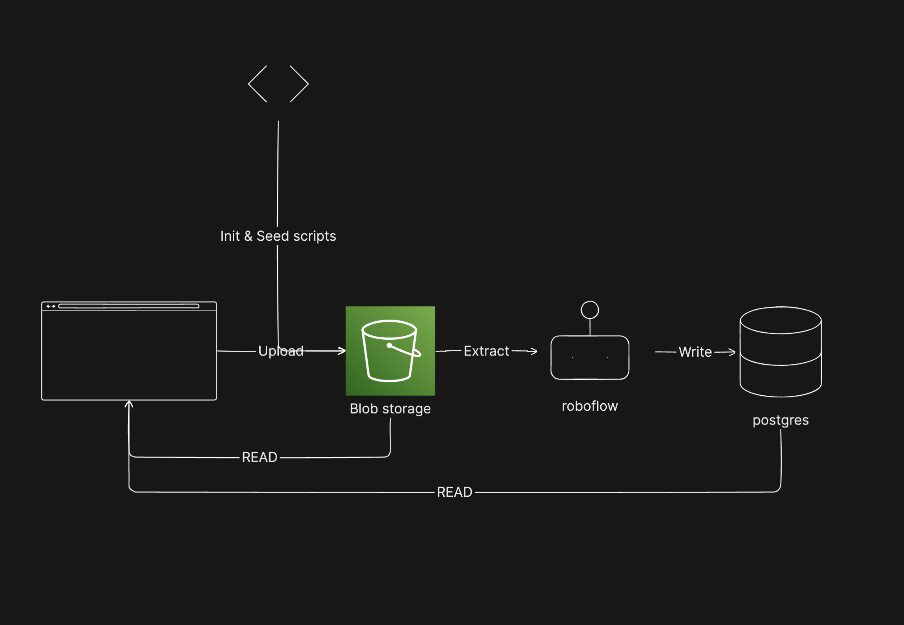

# Stolen Car Detector

## Background

Imagine you are part of a local law enforcement department tasked with finding missing and/or stolen vehicles. You use [stolen-car-detector](https://stolen-car-detector.vercel.app/), an internal web application, to comb through a growing database of vehicle images to find vehicles that have been reported missing. The application allows you to search by vehicle license plate text to match against images of the vehicles themselves. Additionally, most vehicle entries have a date and location of when/where they were last seen to help in your search. Finally, the application allows you to upload new photos of vehicles, with associated metadata, so that you can stay up to date on the latest vehicle reports.

## Technical Details

This application is built with [Next.js](https://nextjs.org/), deployed on [Vercel](https://vercel.com/), and powered by Roboflow's [Inference OCR](https://inference.roboflow.com/foundation/doctr/) model. At it's core, the application will:

- accept an image file from the user
- attempt to upload it to a [file storage bucket](https://vercel.com/docs/storage/vercel-blob)
- read and extract text via Inference
- write the text value, and other metadata, to a [serverless postgresql database](https://vercel.com/docs/storage/vercel-postgres)

From there, the application fetches and loads this data to display it in an intuitive way. For matching user-input license plate text against the metadata database, I use a combination of [fuzzy search](https://www.postgresql.org/docs/current/pgtrgm.html) and [wildcard](https://www.postgresql.org/docs/7.3/functions-matching.html) matching to find license plates (even if they don't exactly match). I leaned on [shadcn-ui](https://ui.shadcn.com/) for it's component library and UI styling. Finally, I use React [Server Actions](https://react.dev/reference/rsc/server-actions) to query and mutate data directly, and safely, from UI components.

Below you can see a high-level diagram of the image-processing pipeline.

## Things I would have done with more time:

- enhancing pipeline to accept multiple image files as once
- retry logic for upload pipeline, surfacing errors when upload fails
- handle pagination when a query returns a lot of vehicle data
- optimistic updates when uploading new vehicles
- React `<Suspense>` to handle UI loading state
- component and function memoization, React-specific performance improvements to prevent unnecessary re-renders
